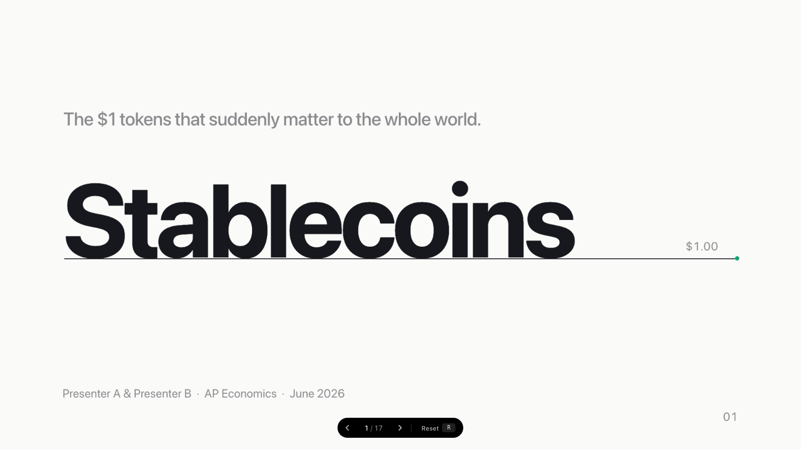
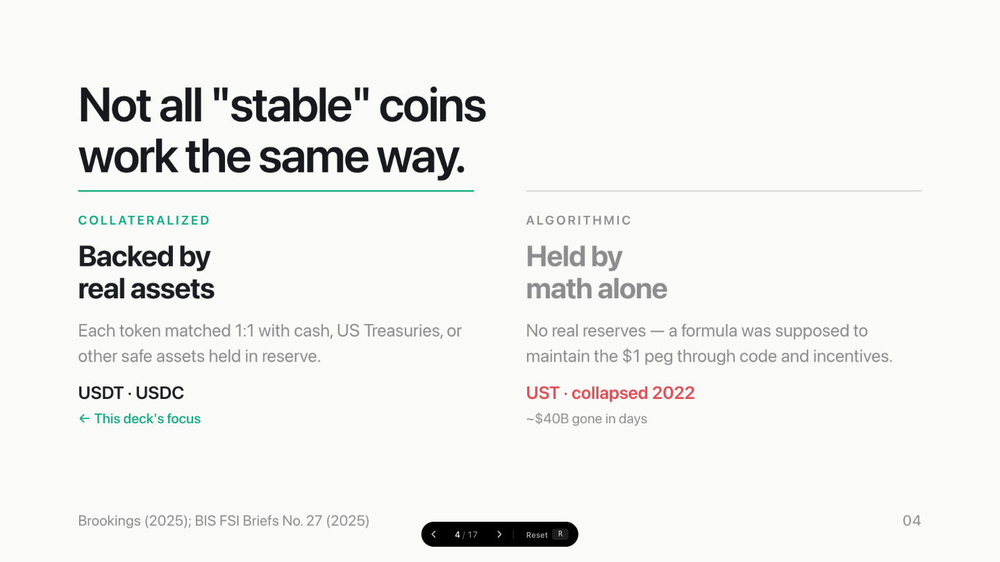
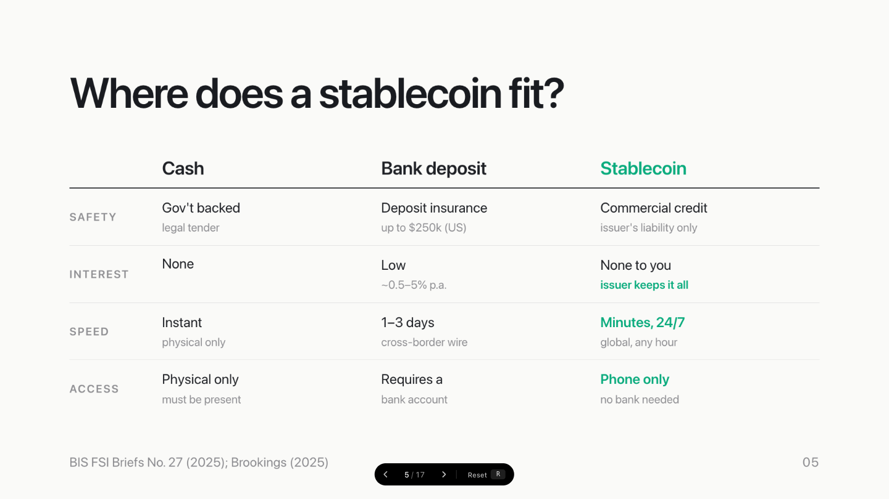
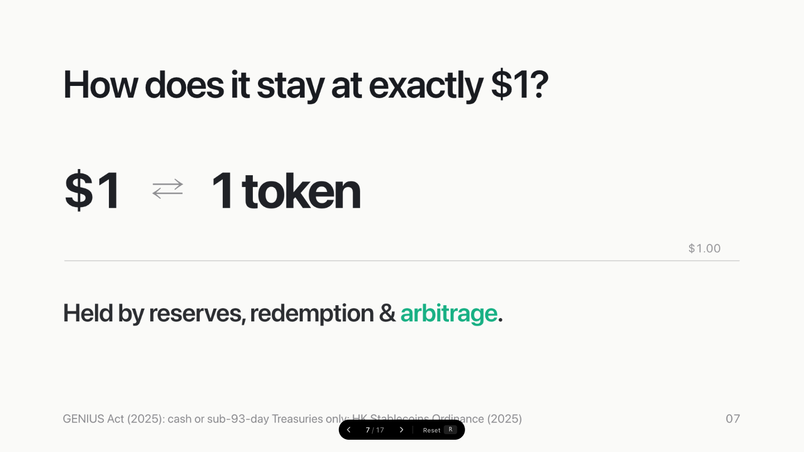
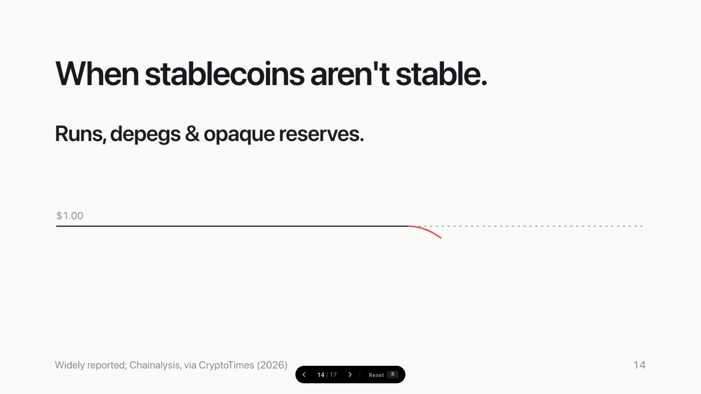

# Peg Design System — Minimal Slide & Presentation Framework

> A type-led, data-first design system for slide decks, web presentations, and React UI components. Built on restraint: one background, one accent, no shadows.

**[English](#english) · [中文](#中文)**

---

## Preview

| Title slide | Types comparison |
|---|---|
|  |  |

| Data comparison table | Mechanism slide |
|---|---|
|  |  |



---

## English

### What is Peg?

**Peg** is an open-source design system and slide framework extracted from a production presentation deck. It gives you a complete, opinionated visual language for building beautiful, readable presentations in HTML/CSS and React — without touching a design tool. Ships with a Claude Skill (`SKILL.md`) for direct import into **Claude Design**.

Key characteristics:
- **Minimal palette** — 6 tokens, one warm-white background, one jade accent
- **Type-led hierarchy** — Inter variable font, aggressively negative tracking, no decorative elements
- **Data-first** — tabular numerals, SVG 2px chart lines, count-up animations built in
- **Flat & fast** — no shadows, no gradients, no card chrome; content lives directly on paper
- **Accessible by default** — all animations respect `prefers-reduced-motion`; DOM always shows final state

---

### Use Cases

| Scenario | What to use |
|---|---|
| Build a slide deck in HTML | `slides/` templates + `slides/slide-base.css` |
| Prototype a data-heavy UI | `components/core/` React components |
| Adopt the design tokens only | `tokens/*.css` |
| Browse the design language | `guidelines/*.card.html` |

---

### Eight Slide Templates

| Template | Purpose |
|---|---|
| **Title** | Deck opener — wordmark + $1.00 peg line |
| **Headline** | One bold claim + supporting sentence |
| **Stats** | Two key figures with short descriptors |
| **Flow** | Left-to-right value or process chain |
| **Chips** | Labelled category grid with context |
| **Attr List** | Define something with 3–4 bold-term properties |
| **Moment** | Centred full-frame question or provocation |
| **Media / Proof** | Show real renders, CAD, PCB, photos, screenshots — full-bleed, split (text + figure), or a 2–4 figure proof wall |

#### Media / Proof slides

Three image layouts, all on-language (hairline frames, no shadows, captions in caption type):

- `<section class="media-full">` — the image **is** the slide (Night letterbox). Children: `` (use `contain` to show a whole part, drop it to fill/crop), optional `.media-scrim`, `.media-label`, `.media-title`, `.media-cap`.
- `<section class="paper media-split">` — text on the left (`.media-text`), one framed `<figure class="media-figure">` on the right.
- `<section class="paper media-wall">` — a `.wall` of 2–4 `<figure class="cell">`, each with a `.fig` and a `<figcaption>`.

Every image slide should carry an evidence tag (`.evi` → RENDER / CAD / PCB / PROTOTYPE / APP) and a one-line caption, so the audience knows what they're looking at and that it's real.

---

### Five Core React Components

| Component | Purpose |
|---|---|
| `PegLine` | The signature $1.00 horizontal baseline |
| `FlowBand` | Arrow-chained flow diagram |
| `Chip` | Bordered pill for key/value metadata |
| `StatBlock` | Large formatted number + descriptor |
| `AttrList` | Stacked property definition rows |

---

### Design Tokens

```
tokens/
  colors.css      — 6 palette values + semantic aliases
  typography.css  — 7 type roles, tracking, weight
  spacing.css     — spacing scale + 1920×1080 canvas geometry
  effects.css     — line weights, radii, motion curves
  fonts.css       — Inter variable @font-face
```

---

### Colour Palette

| Token | Value | Role |
|---|---|---|
| `--color-paper` | `#FAFAF8` | Only background — warm, never cold |
| `--color-ink` | `#16181D` | Primary text and lines |
| `--color-night` | `#0B0B0C` | Stage chrome, outer letterbox |
| `--color-jade` | `#00A878` | Default accent — one use per slide |
| `--color-alert` | `#E5484D` | Danger only — losses, risk, collapse |
| `--color-mute` | `#8A8A8E` | Labels, footnotes, secondary text |

**Topic accents (muted, meaning-bearing).** For a multi-section deck, give each section its own *calm* hue instead of jade everywhere — set `--accent: var(--topic-…)` on the `<section>` and every accent utility (`.jade` text, `.evi` tag, diagram strokes `.s-jade`/`.box-j`/`.t-j`/`.f-jade`) follows it automatically. Keep them muted (Apple-keynote, never neon) and consistent per module (eyebrow = keyword = diagram = same hue).

| Token | Value | Meaning |
|---|---|---|
| `--topic-control` | `#128A6B` | teal — real-time control / signal |
| `--topic-silicon` | `#3A6AA0` | blue — electronics / PCB |
| `--topic-material` | `#8C6B38` | bronze — material / industrial design |
| `--topic-safety` | `#AC5A3C` | clay — safety-critical (not alarm-red) |
| `--topic-algo` | `#6A57A0` | violet — algorithm / intelligence |
| `--topic-growth` | `#4F8A52` | sage — data / growth |

**Layout patterns.** `.headline.with-fig` steps the headline down a size when it shares the slide with a diagram; `.media-split .media-text .headline` does the same for a narrow text column; `.summary` is a centered one-line takeaway placed *below* a diagram so the eye reads the diagram then drops to the conclusion; **`.plain`** is a one-sentence *plain-language explainer* (accent left-rule) placed under the headline for a non-expert audience — the slide keeps its technical content, this line just makes it land for everyone (bold the one phrase that matters; on a headline+figure slide cap its `max-width` to the text column; mind 2-line headlines when setting `top`). See template 11 in `slides/`. **`.compare`** is a before→after / problem→solution table (rows of *old limitation* → *what we now do*) — the clearest way to show **iteration** at a glance; `.badge-first` flags genuinely first-of-kind rows (use sparingly, back the claim). See template 12.

---

### Typography Scale

| Role | Size | Tracking | Weight |
|---|---|---|---|
| Wordmark | 248px | −0.04em | 700 |
| Hero | 300px | −0.04em | 700 |
| Headline | 92px | −0.03em | 600 |
| Subhead | 60px | −0.02em | 600 |
| Support | 44px | −0.01em | 400 |
| Caption | 28px | 0 | 400 |

---

### Quick Start

```html
<!-- Link the token chain -->
<link rel="stylesheet" href="styles.css">
<link rel="stylesheet" href="slides/slide-base.css">

<!-- Use a slide template -->
<div class="slide slide--headline">
  <div class="frame">
    <p class="label">SECTION LABEL</p>
    <h1 class="headline">A bold one-line claim.</h1>
    <p class="support">Supporting sentence that adds context.</p>
  </div>
</div>
```

---

### File Structure

```
styles.css              Entry point (@import chain)
tokens/                 CSS custom properties
components/core/        React components (.jsx + .d.ts + .prompt.md)
slides/                 7 HTML slide templates + base CSS
guidelines/             Visual documentation cards
assets/                 Inter variable font
```

---

### Design Principles

1. **One background.** Paper (`#FAFAF8`) only. No dark slides, no gradients.
2. **One accent.** Jade once per slide, maximum. Never decorative.
3. **Alert is earned.** `#E5484D` for genuine bad news only.
4. **No shadows.** No elevation. Content lands on paper.
5. **Final state first.** Screenshots and PDFs always show complete slides.
6. **Tabular numerals everywhere.** No column-width jitter.
7. **Negative tracking on display text.** Tight, not loose.

---

### Motion & Animation

Peg includes a built-in animation engine (`peg-animate.js`) for Keynote-like entrance effects and slide transitions.

#### Motion Tokens (in `tokens/effects.css`)

| Token | Value | Purpose |
|---|---|---|
| `--ease-reveal` | `cubic-bezier(0.2, 0.65, 0.2, 1)` | Standard entrance easing |
| `--ease-out-expo` | `cubic-bezier(0.16, 1, 0.3, 1)` | Fast deceleration, snappy entries |
| `--ease-spring` | `cubic-bezier(0.34, 1.56, 0.64, 1)` | Overshoot spring, for hero numbers |
| `--ease-in-out` | `cubic-bezier(0.65, 0, 0.35, 1)` | Symmetric, for slide transitions |
| `--dur-fast` | `200ms` | Quick micro-interactions |
| `--dur-normal` | `400ms` | Standard UI transitions |
| `--dur-slow` | `820ms` | Default build animation duration |
| `--dur-draw` | `1400ms` | SVG path drawing (e.g., depeg chart) |
| `--dur-page` | `500ms` | Slide transition duration |

#### Build Animations (Entrance Effects)

Add `data-peg-animate` to any element inside a slide:

| Type | Keyframes | Best For |
|---|---|---|
| `fade-up` | `opacity 0→1, translateY(22px)→0` | Default for text, containers |
| `scale-in` | `opacity 0→1, scale(0.8)→1` | Hero numbers, wordmarks |
| `blur-in` | `opacity 0→1, filter blur(8px)→0` | Background elements |
| `reveal-right` | `opacity 0→1, translateX(30px)→0` | Flow nodes, list items |
| `letter-spring` | each character `opacity 0→1, translateY(0.72em)→0` with spring overshoot | One-line title or moment slides |
| `text-flip` | `opacity 0→1, translateY(0.42em)→0, rotateX(-82deg)→0` | Calm single-line text reveal |
| `draw` | SVG stroke draws on along its own path (`stroke-dashoffset` len→0) | **Lines, waveforms, chart curves, flow connectors** — a transient left-to-right *sweep*, never a perpetual loop |

**Drawing lines & flows (the silky bit).** Put `data-peg-animate="draw"` on a **solid** SVG `<path>`/`<line>` (not an intentionally-dashed one) and it sweeps on left-to-right; duration follows `--dur-draw`, override with `data-peg-duration`. For a **flow / timeline that reveals left-to-right**, draw the baseline/connector with `draw` and stagger the nodes one-by-one (`data-peg-stagger` on the parent `<g>`, `data-peg-animate="fade-up"` on each node) with increasing `data-peg-delay`. The resting DOM is the full solid stroke, so screenshots / PDF export always show the finished line.

**Delays:** Use `data-peg-delay="80"` (ms) for individual timing.<br>
**Stagger:** Add `data-peg-stagger="100"` to a parent for automatic sibling delays.<br>
**Letter stagger:** Use `data-peg-letter-stagger="34"` (ms) for per-character timing.

```html
<div class="headline" data-peg-animate="fade-up" data-peg-delay="80">Title</div>
<div class="hero" data-peg-animate="scale-in" data-peg-delay="200">$306B</div>
<div class="headline" data-peg-animate="letter-spring">A one-line moment.</div>
<div class="chips" data-peg-stagger="100">
  <div class="chip" data-peg-animate="fade-up">Item 1</div>
  <div class="chip" data-peg-animate="fade-up">Item 2</div>
</div>
```

Open `letter-spring-demo.html` to preview the per-character title reveal.

**Backward compatible:** `.build.d1` through `.build.d5` classes still work (mapped to `fade-up` with 80/200/320/440/560ms delays).

#### Count-Up Numbers

Add `data-peg-count` or use `.count` class with data attributes:

```html
<div class="stat-n count" data-to="306" data-pre="$" data-suf="B" data-cdelay="360">$306B</div>
```

#### Data Bars

Add `data-peg-bar` to bars or use `.bar-fill` / `.progress-fill`. Horizontal bars grow left-to-right; vertical bars grow bottom-to-top.

```html
<div class="bar-fill" style="width:72%;"></div>
<div data-peg-bar="vertical" style="height:180px;"></div>
```

Use `data-peg-bar-duration`, `data-peg-bar-delay`, and `data-peg-bar-easing` for local timing overrides. The resting DOM remains the final value for screenshots, PDF, and PPTX export.

#### Slide Transitions

Add `data-peg-transition` to `<section>` (slide) elements:

| Value | Effect |
|---|---|
| `dissolve` | Crossfade (old fades out, new fades in) |
| `push-left` | New slides in from right, old slides out left |
| `text-flip` | Old slide flips upward while the new slide flips in from below on the same timeline |
| `none` | Instant cut (default) |

```html
<section class="paper" data-label="Title" data-peg-transition="text-flip">...</section>
```

Transitions respect `prefers-reduced-motion` and are disabled when `noscale` is set on `<deck-stage>`. Open `transition-demo.html` to compare cut, dissolve, push-left, and text-flip.

#### Initialization

```html
<script src="deck-stage.js"></script>
<script src="peg-animate.js"></script>
<script>
  PegAnimate.init('deck-stage');
</script>
```

---

### Designing for Chinese (中文)

Peg is bilingual. Latin (Inter) is tuned for tight negative tracking and compact
leading; Chinese needs the opposite — square em-box glyphs collide under negative
tracking and cramp under tight leading. `tokens/cjk.css` re-tunes the type tokens
**only** when the document language is Chinese, so Latin decks are unaffected.

- Set `lang="zh-CN"` (or any `zh-…`) on `<html>` — the CJK layer activates
  automatically: tracking relaxes toward zero, display leading opens up
  (`--lh-tight` 1.12 / `--lh-snug` 1.20 / `--lh-body` 1.7).
- Chinese glyphs render in **Noto Sans SC**; Latin/numerals stay in **Inter**
  (per-glyph fallback), so a mixed line like “重写 ESP-IDF” looks right.
- Use the `.latin` class on a pure-Latin element inside a Chinese deck to restore
  Inter's tight tracking just for that element (e.g. a wordmark).
- For an offline / portable / PDF-exported Chinese deck, bundle the font with the
  deck (or a `pyftsubset` subset of the used glyphs) — don't rely on system fonts.

### Fonts & Licenses

The design system's code is **MIT**. The bundled fonts are **not** MIT — they ship
under the **SIL Open Font License 1.1 (OFL)** and are redistributed here with their
license text, as the OFL requires:

| Font | Role | License | Source |
|---|---|---|---|
| **Inter** by Rasmus Andersson | Latin / numerals | SIL OFL 1.1 — [`assets/Inter-OFL.txt`](assets/Inter-OFL.txt) | github.com/rsms/inter |
| **Noto Sans SC** by Google | Chinese (简体) | SIL OFL 1.1 — [`assets/NotoSansSC-OFL.txt`](assets/NotoSansSC-OFL.txt) | fonts.google.com/noto |

Under the OFL you may use, embed, and redistribute both fonts (incl. commercially)
provided the license text travels with them and the fonts are not sold on their own.
Keep the `*-OFL.txt` files alongside `assets/*.ttf` in any redistribution.

> Repo size note: `assets/NotoSansSC.ttf` is a full variable font (~17 MB). For a
> shipped deck, subset it to the glyphs you actually use to stay lean.

### License

**Code & design tokens:** MIT — use freely in commercial and personal projects.
**Bundled fonts (`assets/*.ttf`):** SIL OFL 1.1 (see *Fonts & Licenses* above).

---

---

## 中文

### Peg 是什么？

**Peg** 是一套开源设计系统与幻灯片框架，从一套生产级演示文稿中提炼而来。它为你提供完整、有主张的视觉语言，让你用 HTML/CSS 和 React 构建美观、可读性强的演示文稿——无需打开任何设计工具。包含 Claude Skill（`SKILL.md`），可直接导入 **Claude Design** 使用。

核心特点：
- **极简配色** — 6 个色彩 token，一种暖白背景，一种翠绿强调色
- **以字排版为核心** — Inter 可变字体，强负字间距，零装饰元素
- **数据优先** — 等宽数字、SVG 2px 图表线、内置数字滚动动画
- **扁平快速** — 无阴影、无渐变、无卡片边框；内容直接落在纸面上
- **默认可访问** — 所有动画尊重 `prefers-reduced-motion`；DOM 始终展示最终状态

---

### 适用场景

| 场景 | 使用内容 |
|---|---|
| 用 HTML 制作幻灯片 | `slides/` 模板 + `slides/slide-base.css` |
| 原型设计数据密集型 UI | `components/core/` React 组件 |
| 仅引入设计 token | `tokens/*.css` |
| 浏览设计语言规范 | `guidelines/*.card.html` |

---

### 八种幻灯片模板

| 模板 | 用途 |
|---|---|
| **Title（标题页）** | 封面——品牌字标 + $1.00 基准线 |
| **Headline（主张页）** | 一句粗体核心论点 + 补充说明 |
| **Stats（数据页）** | 两组关键数字 + 简短描述 |
| **Flow（流程页）** | 从左到右的价值/流程链 |
| **Chips（分类页）** | 带标签的分类网格 |
| **Attr List（属性页）** | 3–4 条粗体术语定义列表 |
| **Moment（转场页）** | 居中全屏问句或论点 |
| **Media / Proof（实证页）** | 放真实渲染图/CAD/PCB/实物照/截图——整幅、图文左右分栏、或 2–4 图实证墙 |

#### 实证 / 图片页

三种图片版式,均遵循设计语言(细线边框、无阴影、说明用 caption 字号):

- `<section class="media-full">` — 整幅:图片**就是**整页(Night 信箱底)。子元素:``(`contain` 显示完整零件,去掉则填满裁切)、可选 `.media-scrim`、`.media-label`、`.media-title`、`.media-cap`。
- `<section class="paper media-split">` — 左文右图:左侧 `.media-text`,右侧一个带框 `<figure class="media-figure">`。
- `<section class="paper media-wall">` — 实证墙:一个 `.wall` 里放 2–4 个 `<figure class="cell">`,每个含 `.fig` + `<figcaption>`。

每张图片页都应带**证据标签**(`.evi` → RENDER / CAD / PCB / PROTOTYPE / APP)和一句说明,让观众清楚自己看到的是什么、且确为真实产物。

---

### 五个核心 React 组件

| 组件 | 用途 |
|---|---|
| `PegLine` | 标志性 $1.00 水平基准线 |
| `FlowBand` | 带箭头的流程图 |
| `Chip` | 带边框的键值标签胶囊 |
| `StatBlock` | 大字号数字 + 描述文字 |
| `AttrList` | 堆叠式属性定义行 |

---

### 设计 Token

```
tokens/
  colors.css      — 6 个调色板值 + 语义别名
  typography.css  — 7 种文字角色、字间距、字重
  spacing.css     — 间距比例 + 1920×1080 画布几何
  effects.css     — 线宽、圆角半径、动效曲线
  fonts.css       — Inter 可变字体 @font-face
```

---

### 配色方案

| Token | 色值 | 用途 |
|---|---|---|
| `--color-paper` | `#FAFAF8` | 唯一背景色，暖白 |
| `--color-ink` | `#16181D` | 主文本与线条 |
| `--color-night` | `#0B0B0C` | 舞台边框、外侧信箱区 |
| `--color-jade` | `#00A878` | 单一强调色，每张幻灯片最多使用一次 |
| `--color-alert` | `#E5484D` | 仅用于危险/损失/风险场景 |
| `--color-mute` | `#8A8A8E` | 标签、注脚、次要文本 |

---

### 设计原则

1. **只有一种背景**：Paper (`#FAFAF8`)，无深色页、无渐变页。
2. **只有一种强调色**：Jade 每页最多出现一次，不用于装饰。
3. **Alert 色需要理由**：`#E5484D` 仅用于真实的坏消息。
4. **无阴影**：无高程层级，内容直接落在纸面。
5. **最终状态优先**：截图与 PDF 导出始终显示完整幻灯片。
6. **等宽数字无处不在**：防止列宽抖动。
7. **标题文字强负字间距**：紧凑而非松散。

---

### 快速开始

```html
<!-- 引入 token 链 -->
<link rel="stylesheet" href="styles.css">
<link rel="stylesheet" href="slides/slide-base.css">

<!-- 使用幻灯片模板 -->
<div class="slide slide--headline">
  <div class="frame">
    <p class="label">章节标签</p>
    <h1 class="headline">一句醒目的核心论点。</h1>
    <p class="support">补充一句上下文说明。</p>
  </div>
</div>
```

---

### 动效补充

大标题页的一行字可用 `data-peg-animate="letter-spring"`，每个字母/汉字会从下方逐个弹性甩入并渐现，适合 Keynote 风格的 moment slide。用 `data-peg-letter-stagger="34"` 调整逐字间隔。

```html
<div class="headline" data-peg-animate="letter-spring">A one-line moment.</div>
```

如果需要更克制、无弹性的单行文字翻入，可用 `data-peg-animate="text-flip"`。

**线条 / 波形 / 流程图的丝滑动效。** 给**实线** SVG `<path>`/`<line>`(不要给本就虚线的)加 `data-peg-animate="draw"`，它会沿自身路径**从左到右扫出**(`stroke-dashoffset`，时长跟随 `--dur-draw`)——用于折线、波形、图表曲线、流程连线;是一次性的扫入,不是无限循环(无限循环是廉价感来源)。**让流程/路程图从左到右依次出现**:基线/连线用 `draw`,节点用 `data-peg-stagger`(父 `<g>`)+ `data-peg-animate="fade-up"`(每个节点)配合递增 `data-peg-delay`。静止 DOM 始终是完整实线,截图 / PDF 导出显示成品。

**多幕配色:** 给每个 `<section>` 设 `--accent: var(--topic-…)`(见上方主题色表),该页所有强调元素(关键词、`.evi`、图表线)自动跟随;低饱和、每页一种、同页一致。**图文同页**用 `.headline.with-fig` 把标题降一档;**图下结论**用 `.summary` 居中放在图的下方做引导;**`.plain`(大白话行)** 放在标题下、带主题色竖条,给非专业观众一句人话——幻灯片保留技术内容,这行只让所有人都看懂(加粗最关键那半句;图文同页要限 `max-width` 到文字栏;两行标题时注意 `top` 别压住)。样本见 `slides/` 模板 11。**`.compare`(前后对比表)** 每行「过去的局限 → 现在怎么做」,是给非专业观众**一眼看懂"迭代了什么"**最有效的形式;`.badge-first` 给真正"行业首创"的行打徽标(少用、且要有依据)。样本见模板 12。

```html
<div class="headline" data-peg-animate="text-flip">A calm upward reveal.</div>
```

打开 `letter-spring-demo.html` 可预览逐字标题动效。

数据柱、横条、进度条可加 `data-peg-bar`，或直接使用 `.bar-fill` / `.progress-fill`。横向默认从左到右增长；竖向使用 `data-peg-bar="vertical"`，从底部向上增长。

```html
<div class="bar-fill" style="width:72%;"></div>
<div data-peg-bar="vertical" style="height:180px;"></div>
```

可用 `data-peg-bar-duration`、`data-peg-bar-delay`、`data-peg-bar-easing` 单独调整时长、延迟和曲线。DOM 保持最终数值，截图、PDF、PPTX 导出不显示半成品。

页面切换可在 `<section>` 上添加 `data-peg-transition="dissolve"`、`data-peg-transition="push-left"` 或 `data-peg-transition="text-flip"`；`text-flip` 会让旧画面向上翻出，同时新画面从下方翻入，两个动作在同一时间轴上连贯进行。不设置时为默认瞬切。切换动效尊重 `prefers-reduced-motion`，并在 `noscale` 导出模式下关闭。打开 `transition-demo.html` 可对比 cut、dissolve、push-left、text-flip。

```html
<section class="paper" data-label="Title" data-peg-transition="text-flip">...</section>
```

---

### 中文排版

Peg 双语可用。拉丁字体(Inter)为强负字距 + 紧凑行高而调;中文恰好相反——方块字在负字距下会相互挤撞、在紧行高下多行会发闷。`tokens/cjk.css` **仅在文档语言为中文时**重新调校排版 token,英文 deck 不受影响。

- 在 `<html>` 上设 `lang="zh-CN"`(或任意 `zh-…`),中文排版层自动生效:字距放松趋近 0,显示行高打开(`--lh-tight` 1.12 / `--lh-snug` 1.20 / `--lh-body` 1.7)。
- 汉字用 **Noto Sans SC** 渲染,拉丁字母/数字仍用 **Inter**(逐字回退),所以「重写 ESP-IDF」这种中英混排也对。
- 中文 deck 里若有纯拉丁元素(如品牌字标),给它加 `.latin` 类即可单独恢复 Inter 的紧字距。
- 离线/换机/导 PDF 的中文 deck:把字体随 deck 打包(或用 `pyftsubset` 子集化到实际用字),**不要**依赖系统字体。

### 字体与许可

设计系统的**代码是 MIT**;但随附字体**不是 MIT**——它们以 **SIL 开源字体许可 1.1(OFL)** 发布,并按 OFL 要求随附了许可证全文:

| 字体 | 用途 | 许可 | 来源 |
|---|---|---|---|
| **Inter**(Rasmus Andersson) | 拉丁 / 数字 | SIL OFL 1.1 — [`assets/Inter-OFL.txt`](assets/Inter-OFL.txt) | github.com/rsms/inter |
| **Noto Sans SC**(Google) | 简体中文 | SIL OFL 1.1 — [`assets/NotoSansSC-OFL.txt`](assets/NotoSansSC-OFL.txt) | fonts.google.com/noto |

OFL 允许自由使用、嵌入、再分发(含商用),前提是**许可证文本随字体一同保留**、且不得单独售卖字体本身。再分发时请把 `*-OFL.txt` 与 `assets/*.ttf` 一起带上。

> 仓库体积提示:`assets/NotoSansSC.ttf` 是完整可变字体(~17 MB);打包成 deck 时请子集化到实际用字以保持精简。

### 许可证

**代码与设计 token:** MIT — 可自由用于商业及个人项目。
**随附字体(`assets/*.ttf`):** SIL OFL 1.1(见上方「字体与许可」)。
